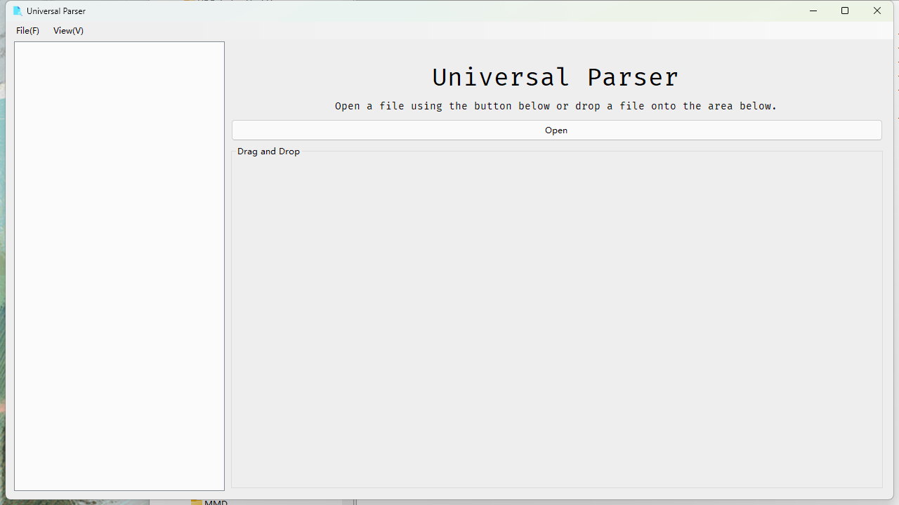
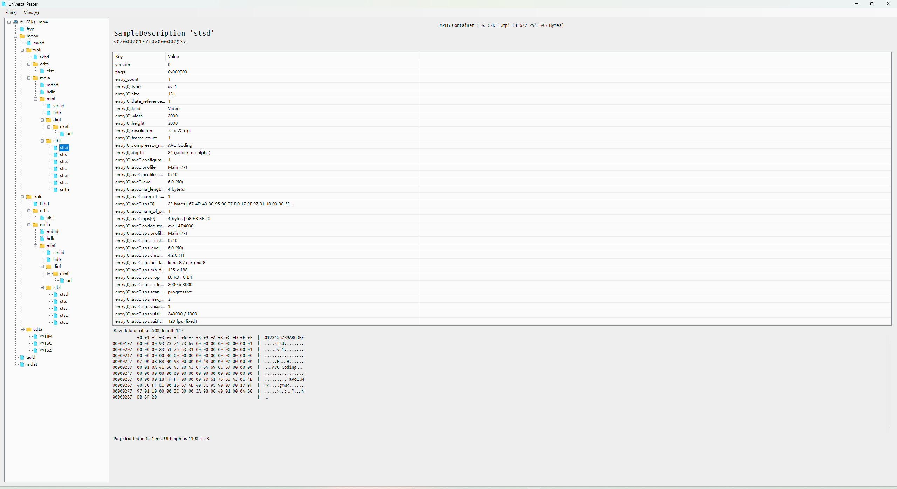
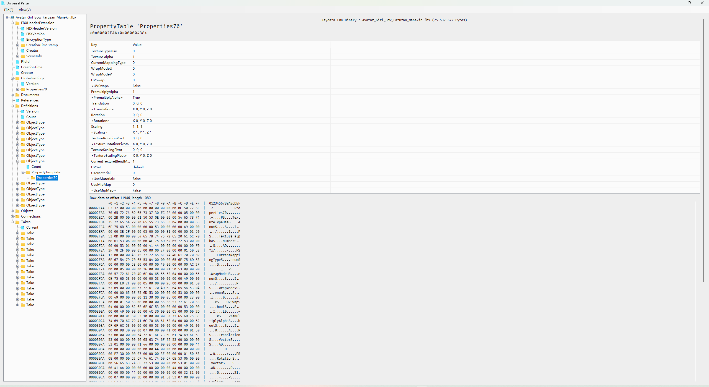

# UniversalParser

A simple tool that supports parsing of most container-based file formats.

English | [中文](README_ZH.md)

## Features

- Supports parsing multiple *container/chunked* file framework formats, including MPEG (ISOBMFF), JPEG, PNG, RIFF, EBML, FLV, FBX, and more.

- Supports parsing most sub-Box/Chunk structures in the above formats, and outputs readable result fields.

> [!NOTE]
>
> This program only supports "raw parsing", i.e., it only splits the file into visual nodes according to its binary tree structure, then faithfully extracts and parses all readable fields from each binary data block, and reasonably converts and outputs human-readable parsing results. It does **not** support actual data payload parsing, validation, decoding, remuxing, and similar features.

### Program Features

- Adheres to raw value presentation. Does not add units, convert, modify, or correct values on its own. However, if a value must be converted or decoded, a new entry wrapped in same-name angle brackets will be used to represent it.

- Appropriate key notes. When non-standard blocks, clearly erroneous values, unexpected data, or truncated remnants are encountered, a `<Note>` will be appropriately added as a reminder.

- High-performance user interface. ListView virtualization keeps the page responsive even when parsing extremely large arrays; the high-performance streaming HexViewer displays the complete binary data of the block and the corresponding ASCII dump in read-only mode.

- Parsing results are exportable. Right-click an item in the left branch tree to export the complete parsing result as a TXT file, so it can be handed over to other programs or AI for analysis. *Note: Use with caution, as converting extremely large blocks to TXT text is not performant and causes file size bloat.*

## Supported Formats

| Container Type | Specific Formats (Extensions) | Content Sub-blocks |
|-|-|-|
| MPEG (ISOBMFF) | mp4 m4v m4a mov m4s heic avif, etc. | ftyp moov moof stsd stco udta meta, etc. |
| RIFF | avi wav ani wem webp, etc. | LIST (INFO) fmt data fact cue avih idx1 VP8X, etc. |
| JPG | jpg jpeg jpe jfjf | FFD8 FFD9 FFE1 FFC1 FFC2 FFC3 FFDA, etc. |
| PNG | png | IDAT IHDR iTxt zTxt sBIT fcTL iCCP bKGD tRNS, etc. |
| EBML | mkv webm | All common elements |
| FBX (binary format) | fbx | All |
| FLV | flv | All |
| ASF | asf wmv | (Under development, support is currently poor) |

It also supports complete parsing of embedded `ID3v2 Tag` and `Exif` binary data that may be present in the above files.

Fallback design: In case of a corrupt file or a currently unsupported format, the entire file is read as a single binary RawData block by default.

## Planned Formats

- [ ] ASF
- [ ] Flash SWF
- [ ] IFF

## GUI Screenshots

## Footnotes and Disclaimer

- This program makes heavy use of AI-generated code, including but not limited to DeepSeek v4 flash, Claude opus 5, ChatGPT*, and the Gemini web version (the order indicates the size of code contribution). However, to ensure quality and correctness, each AI was asked to search and generate code modules according to the official specifications. After obtaining the code, it was manually adjusted and modified, then tested locally on multiple real files before being adopted.

- Due to the context limitations of AI programming and deliberate trade-offs made at the human's request, weaker parsing safety measures were explicitly adopted. Therefore, this program may encounter unexpected errors on certain already-parsed blocks, and if such an error is caused by a maliciously constructed malformed file, there is a certain probability that the program will crash, and a certain probability that old CVE vulnerabilities may resurface. Although this program strictly does not parse any actual data payloads, it cannot fully guarantee that vulnerabilities will be avoided in the file container format layer. When using this program to parse any file, please first ensure that the file itself comes from a reliable source and does not contain malicious or malformed structures.